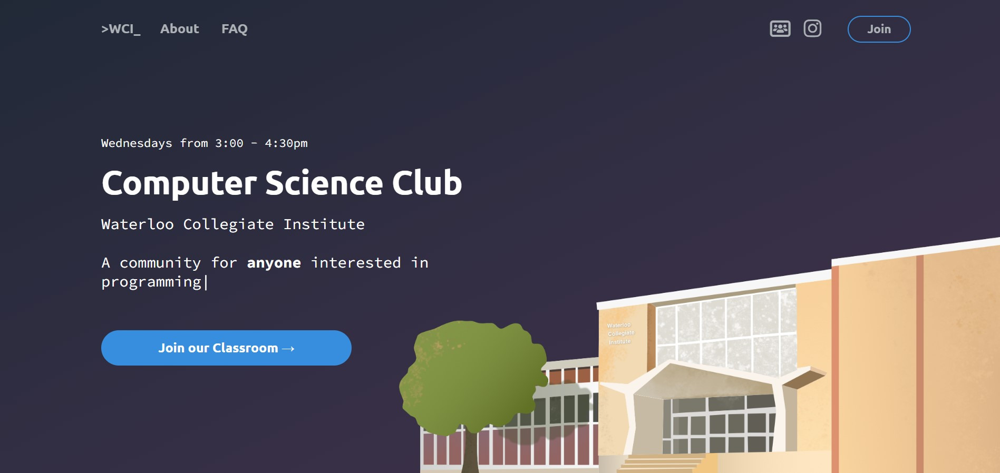

# WCI Computer Science Club

&nbsp;


Visit the website here: https://wcics.vercel.app/

The website serves as the home page for Waterloo Collegiate Institute's Computer Science Club, and includes an attendance tracking system.

## Tech Stack

- Authentication: Google OAuth
- Backend: Flask
- Database: PostgreSQL (hosted on [Supabase](https://supabase.com/))
- Deployment: [Vercel](https://vercel.com/)

## Installation

Follow these instructions to set up a development environment for running the app locally.

First, make sure you have Python and PostgreSQL installed.

1. Create a PostgreSQL database

2. Create a project in the [Google API Console](https://console.developers.google.com/)

3. Create an OAuth client ID, adding `http://127.0.0.1:5000` under Authorised JavaScript origins and `http://127.0.0.1:5000/auth/callback` as an authorised redirect URI

Create a `.env` file with the following secrets:

```
SECRET_KEY=
GOOGLE_CLIENT_ID=
GOOGLE_CLIENT_SECRET=
DATABASE_URL=  # PostgreSQL database connection url
REDIRECT_URI=http://127.0.0.1:5000  # for Google OAuth redirects
```

Follow the steps below to install the dependencies in a virtual environment and run the project.

1. `python3 -m venv venv`

2. `source venv/bin/activate`

3. `pip install -r requirements.txt`

4. `flask run`

On a Windows computer, you should use the following commands to set up the virtual environment:

1. `python -m venv venv`

2. `venv\scripts\activate`